# SeeBu — SRS Diagrams

Use these diagrams for your **Software Requirements Specifications** document.

## How to turn these into images (for Word/PDF)

1. Go to **[mermaid.live](https://mermaid.live)**
2. Copy one diagram code block below (everything between the ` ```mermaid ` lines)
3. Paste it on the left side of the editor
4. Click **Actions → PNG** or **SVG** to download
5. Insert the image into your Word document under the matching section

---

## 1. System Architecture Diagram

Paste under **Section 2.1 Product Perspective**

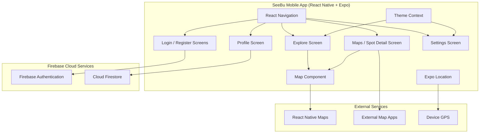

---

## 2. Modular Decomposition Diagram

Paste under **Section 2.1 Modular Decomposition**

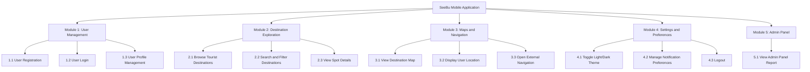

---

## 3. Overall Use Case Diagram

Paste at the start of **Section 3.2 Functional Requirements**

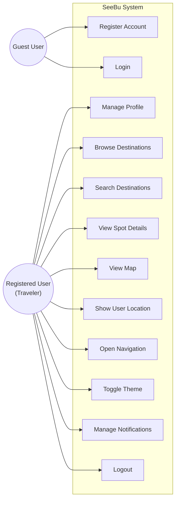

---

# MODULE 1 — USER MANAGEMENT

---

## 1.1 User Registration — Use Case Diagram

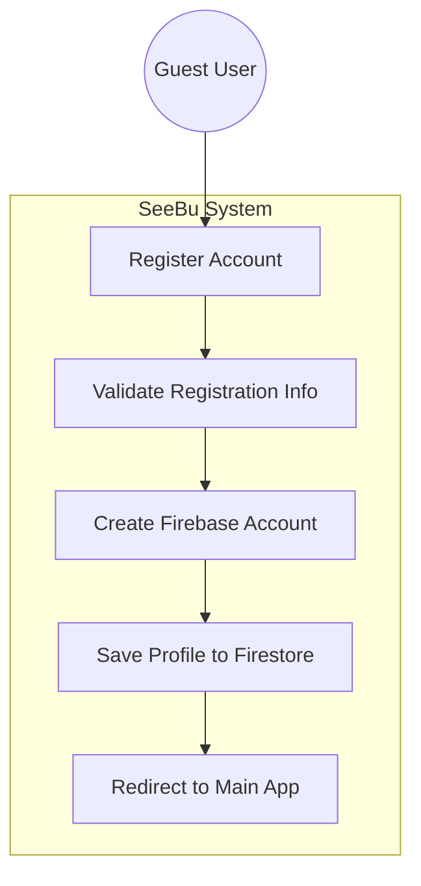

---

## 1.1 User Registration — Activity Diagram

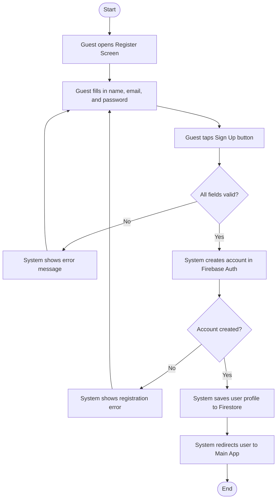

---

## 1.2 User Login — Use Case Diagram

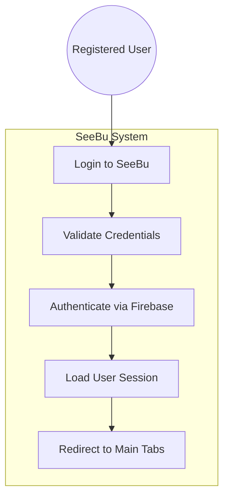

---

## 1.2 User Login — Activity Diagram

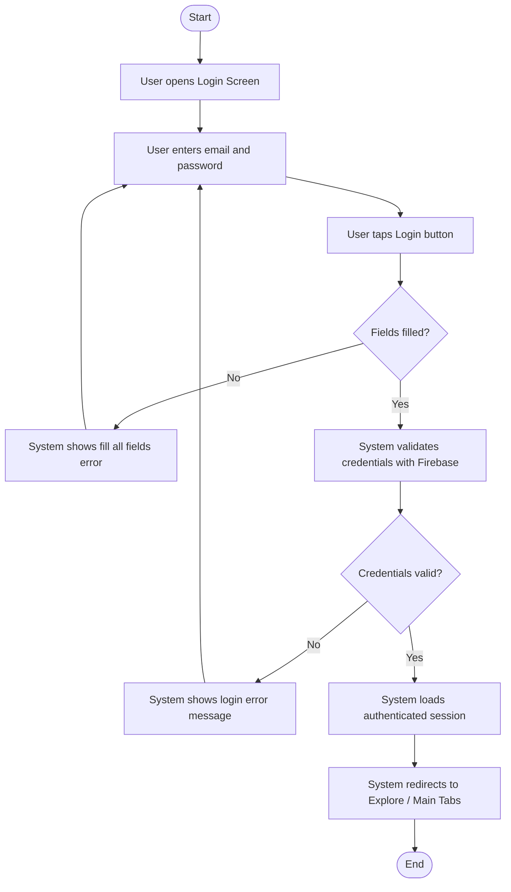

---

## 1.3 User Profile Management — Use Case Diagram

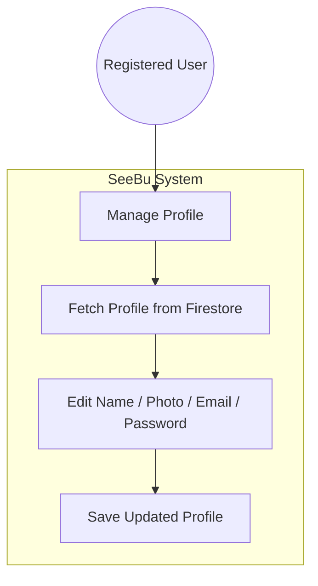

---

## 1.3 User Profile Management — Activity Diagram

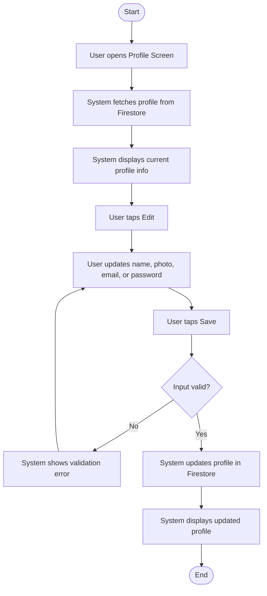

---

# MODULE 2 — DESTINATION EXPLORATION

---

## 2.1 Browse Tourist Destinations — Use Case Diagram

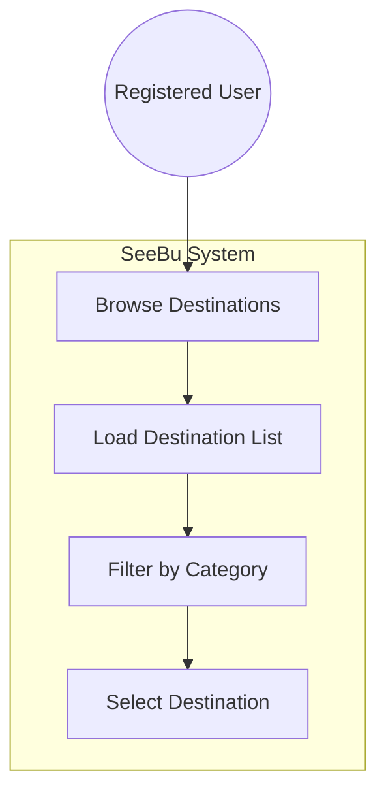

---

## 2.1 Browse Tourist Destinations — Activity Diagram

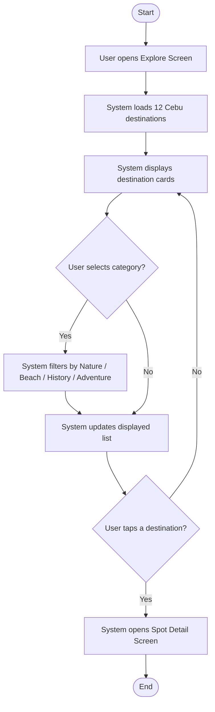

---

## 2.2 Search and Filter Destinations — Use Case Diagram

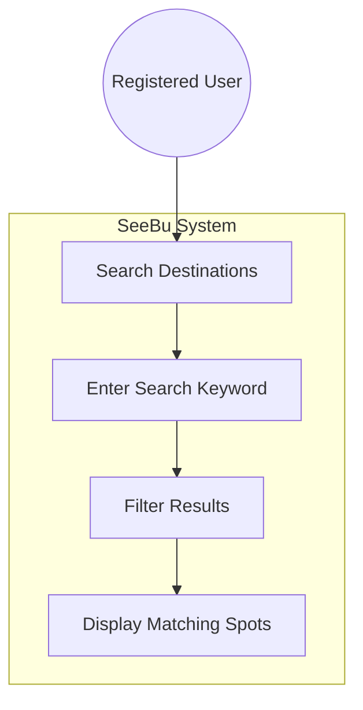

---

## 2.2 Search and Filter Destinations — Activity Diagram

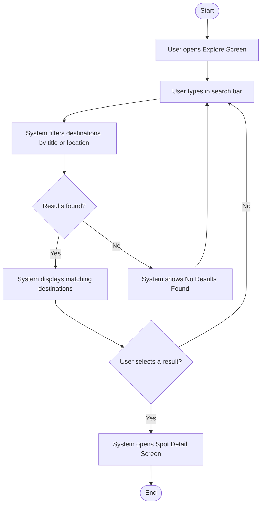

---

## 2.3 View Spot Details — Use Case Diagram

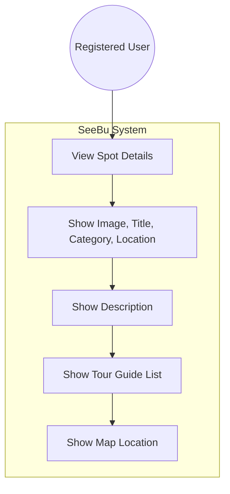

---

## 2.3 View Spot Details — Activity Diagram

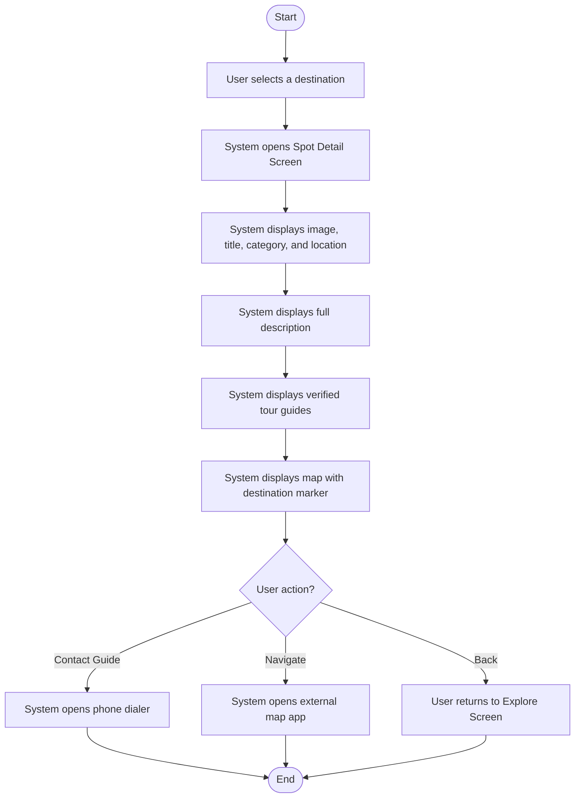

---

# MODULE 3 — MAPS AND NAVIGATION

---

## 3.1 View Destination Map — Use Case Diagram

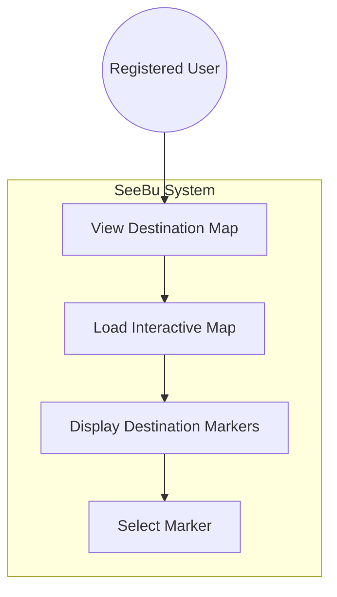

---

## 3.1 View Destination Map — Activity Diagram

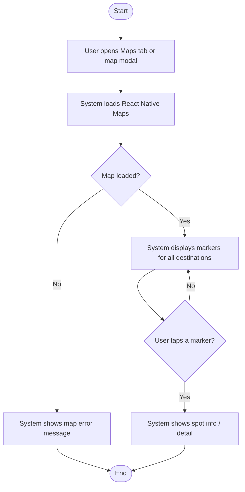

---

## 3.2 Display User Location — Use Case Diagram

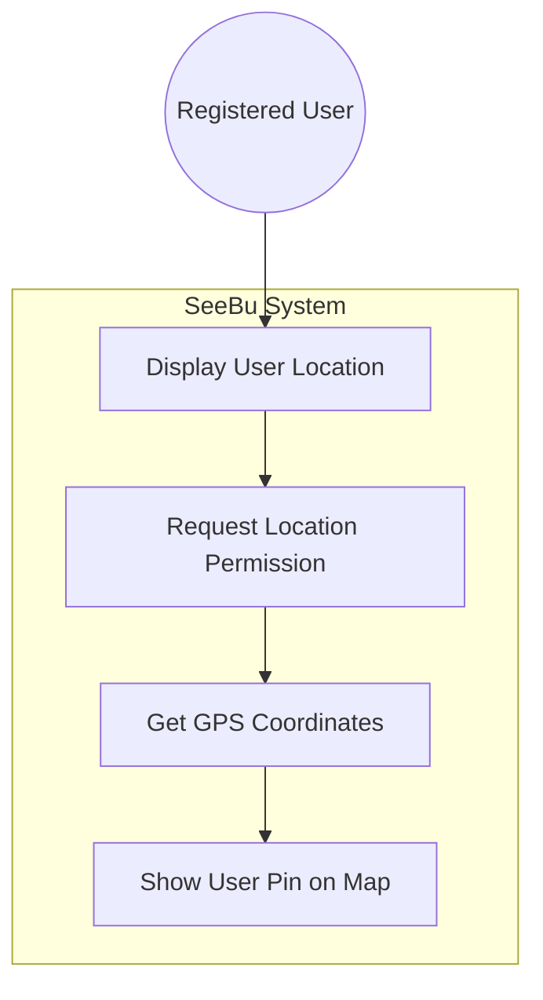

---

## 3.2 Display User Location — Activity Diagram

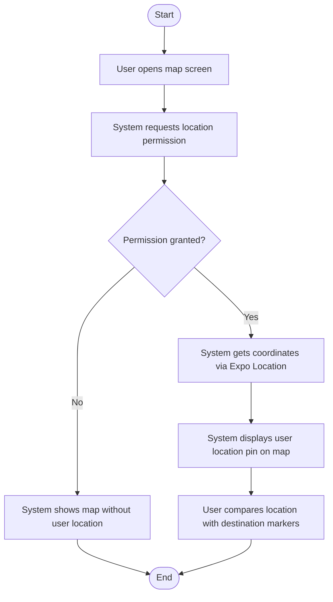

---

## 3.3 Open External Navigation — Use Case Diagram

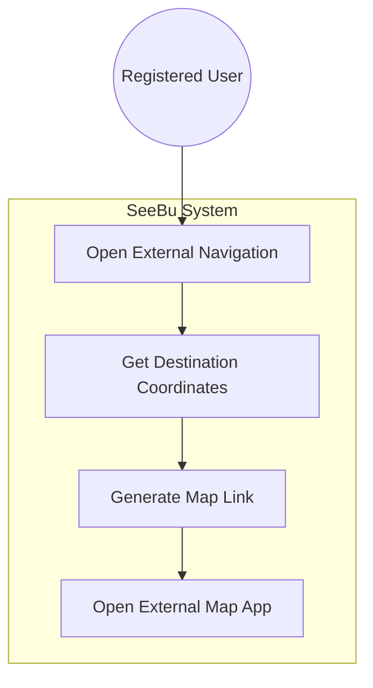

---

## 3.3 Open External Navigation — Activity Diagram

```mermaid
flowchart TD
    START([Start]) --> A["User views destination details"]
    A --> B["User taps Navigate button"]
    B --> C["System retrieves destination coordinates"]
    C --> D{Map app available?}
    D -->|No| E["System shows error message"]
    E --> END([End])
    D -->|Yes| F["System opens Google Maps / device map app"]
    F --> G["User starts navigation to destination"]
    G --> END
```

---

# MODULE 4 — SETTINGS AND PREFERENCES

---

## 4.1 Toggle Light/Dark Theme — Use Case Diagram

```mermaid
flowchart TB
    User(("Registered User"))

    subgraph System["SeeBu System"]
        UC["Toggle Theme"]
        SWITCH["Switch Dark / Light Mode"]
        APPLY["Apply Theme to All Screens"]
    end

    User --> UC
    UC --> SWITCH
    SWITCH --> APPLY
```

---

## 4.1 Toggle Light/Dark Theme — Activity Diagram

```mermaid
flowchart TD
    START([Start]) --> A["User opens Settings Screen"]
    A --> B["User toggles Dark Mode switch"]
    B --> C["System updates Theme Context"]
    C --> D["System applies new colors to all screens"]
    D --> END([End])
```

---

## 4.2 Manage Notification Preferences — Use Case Diagram

```mermaid
flowchart TB
    User(("Registered User"))

    subgraph System["SeeBu System"]
        UC["Manage Notifications"]
        TOGGLE["Enable / Disable Notifications"]
        SAVE["Save Preference"]
    end

    User --> UC
    UC --> TOGGLE
    TOGGLE --> SAVE
```

---

## 4.2 Manage Notification Preferences — Activity Diagram

```mermaid
flowchart TD
    START([Start]) --> A["User opens Settings Screen"]
    A --> B["User toggles notification switch"]
    B --> C["System saves notification preference"]
    C --> D["System shows updated switch state"]
    D --> END([End])
```

---

## 4.3 Logout — Use Case Diagram

```mermaid
flowchart TB
    User(("Registered User"))

    subgraph System["SeeBu System"]
        UC["Logout"]
        CONFIRM["Show Confirmation Modal"]
        SIGNOUT["Sign Out from Firebase"]
        REDIRECT["Redirect to Login Screen"]
    end

    User --> UC
    UC --> CONFIRM
    CONFIRM --> SIGNOUT
    SIGNOUT --> REDIRECT
```

---

## 4.3 Logout — Activity Diagram

```mermaid
flowchart TD
    START([Start]) --> A["User opens Settings Screen"]
    A --> B["User taps Logout"]
    B --> C["System shows confirmation modal"]
    C --> D{User confirms?}
    D -->|No| E["System closes modal"]
    E --> END([End])
    D -->|Yes| F["System signs out via Firebase Auth"]
    F --> G["System redirects to Login Screen"]
    G --> END
```

---

## 5.1 View Admin Panel Report — Use Case Diagram

```mermaid
flowchart TB
    Admin(("Administrator"))

    subgraph System["SeeBu System"]
        UC["View Admin Panel Report"]
        VERIFY["Verify Admin Role"]
        FETCH["Fetch Registered Users"]
        STATS["Display Overview Statistics"]
        LIST["Display Registered Users List"]
        INFO["Display Quick Info"]
    end

    Admin --> UC
    UC --> VERIFY
    VERIFY --> FETCH
    FETCH --> STATS
    STATS --> LIST
    LIST --> INFO
```

---

## 5.1 View Admin Panel Report — Activity Diagram

```mermaid
flowchart TD
    START([Start]) --> A["Administrator opens Settings Screen"]
    A --> B{Is user admin?}
    B -->|No| C["Admin Panel option hidden"]
    C --> END([End])
    B -->|Yes| D["Administrator taps Admin Panel"]
    D --> E["System verifies admin role"]
    E --> F{Role confirmed?}
    F -->|No| G["System redirects back to Settings"]
    G --> END
    F -->|Yes| H["System navigates to Admin Panel"]
    H --> I["System fetches users from Firestore / Mock Auth"]
    I --> J{Data retrieved?}
    J -->|No| K["System shows empty user list"]
    J -->|Yes| L["System calculates statistics"]
    K --> M["System displays Overview cards"]
    L --> M
    M --> N["System displays Registered Users list"]
    N --> O["System displays Quick Info section"]
    O --> P{Administrator taps back?}
    P -->|Yes| Q["System returns to Settings Screen"]
    Q --> END
    P -->|No| O
```

---

## App Navigation Flow (Bonus — good for presentation)

```mermaid
flowchart TD
    START([App Launch]) --> CHECK{User logged in?}

    CHECK -->|No| LOGIN["Login Screen"]
    LOGIN --> REGISTER["Register Screen"]
    REGISTER --> LOGIN
    LOGIN -->|Success| MAIN

    CHECK -->|Yes| MAIN["Main Tabs"]

    MAIN --> EXPLORE["Explore Tab"]
    MAIN --> MAPS["Maps Tab"]
    MAIN --> SETTINGS["Settings Tab"]

    EXPLORE --> DETAIL["Spot Detail Screen"]
    MAPS --> DETAIL
    DETAIL --> GUIDE["Contact Tour Guide"]
    DETAIL --> NAV["Open Navigation"]

    SETTINGS --> THEME["Toggle Theme"]
    SETTINGS --> NOTIF["Toggle Notifications"]
    SETTINGS --> LOGOUT["Logout"]
    LOGOUT --> LOGIN

    SETTINGS --> PROFILE["Profile Screen"]
    PROFILE --> MAIN

    SETTINGS -->|Admin only| ADMIN["Admin Panel"]
    ADMIN --> STATS["View Overview Statistics"]
    ADMIN --> USERLIST["View Registered Users"]
    ADMIN --> SETTINGS
```

---

## Entity Relationship (Bonus — for documentation)

```mermaid
erDiagram
    USER ||--o{ PROFILE : has
    DESTINATION ||--o{ TOUR_GUIDE : includes

    USER {
        string uid PK
        string email
        string displayName
        string profileImg
    }

    PROFILE {
        string uid FK
        string displayName
        string profileImg
    }

    DESTINATION {
        int id PK
        string title
        string type
        string location
        float latitude
        float longitude
        string description
        string image
    }

    TOUR_GUIDE {
        string id PK
        string name
        string specialty
        string location
        float rating
        int reviews
        string contact
        boolean verified
    }
```

---

## Quick Reference — Which diagram goes where

| SRS Section | Diagram to use |
|-------------|----------------|
| 2.1 Product Perspective | System Architecture Diagram |
| 2.1 Modular Decomposition | Modular Decomposition Diagram |
| 3.2 Functional Requirements (intro) | Overall Use Case Diagram |
| 1.1 User Registration | 1.1 Use Case + Activity |
| 1.2 User Login | 1.2 Use Case + Activity |
| 1.3 User Profile Management | 1.3 Use Case + Activity |
| 2.1 Browse Destinations | 2.1 Use Case + Activity |
| 2.2 Search Destinations | 2.2 Use Case + Activity |
| 2.3 View Spot Details | 2.3 Use Case + Activity |
| 3.1 View Destination Map | 3.1 Use Case + Activity |
| 3.2 Display User Location | 3.2 Use Case + Activity |
| 3.3 Open External Navigation | 3.3 Use Case + Activity |
| 4.1 Toggle Theme | 4.1 Use Case + Activity |
| 4.2 Notifications | 4.2 Use Case + Activity |
| 4.3 Logout | 4.3 Use Case + Activity |
| 5.1 View Admin Panel Report | 5.1 Use Case + Activity |
